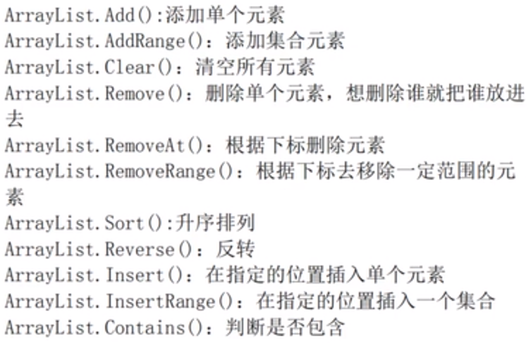

# Object Oriented 面向对象

快捷键操作：
使用CTRL plus r plus e就能直接出现一个属性的定义框架，但是首先要选择要封装的字段，才能实现封装。

## 面向对象的概念

*****

### 面向对象的概念和实现方法如何创建一个实例以及如何给一个类添加字段和方法

类的定义和之前的结构体语法类似，但是结构体是面向过程的，而类是面向对象的，面向对象有三个特征，这是结构体没有的所以之后很少使用结构体这个概念了。
对象就是实例，

类的描述：
[访问修饰符] class 类名
{
    类的描述信息
}

* 访问修饰符 表示这个类的访问权限

* class 关键字 用来声明一个类和之前的enum，struct是类似的。

* 类的描述信息，描述这类事物的特征（字段、属性、方法）

* 类中字段的写法：

```C#
public class Man {
    public string _name; // 理论上字段都要使用private来进行修饰，这样能保证数据的安全性。
    public int _age;
    public char _gender;

    public void Hobby(){
        Console.WriteLine(123)
    }
    // 注意这里是没有加静态的标识符的，加上就不对了
}
// 这个就是一个字段不是一个属性，所以要加一个下划线
// 在定义类的时候最好加上public这个访问修饰符，不加也可以。
```

*****

### 属性的概念

为什么要使用属性，因为直接使用字段的话很容易从外部对字段进行修改，所以使用属性作为一个转化的媒介来保证数据的安全性。
char类型的数据要使用单引号进行引用。只要在get或者set的时候使用一个限定就可以

* 访问修饰符
访问修饰符又叫做访问权限，

1. public 公开的，通过对象名就能直接访问这些public的属性

2. private 私有的，通过对象名.xxx的形式不能访问到，就是不能在外部进行访问，只能在当前类中进行访问。 

3. 创建属性的方法。

属性和字段是不同的概念，这里要进行区分
属性还要首字母大写，字段要加一个下划线。

```C#
public 数据类型 属性名{
    get{return 字段名;}
    set{字段名 = value;}
}
// 解释取值的时候自动调用get方法，set给字段赋值的时候紫红调用，value是一个系统关键字，表示赋值给属性的值。
//get和set本质上就是两个函数。

// 在主程序中给属性赋值
afeng.Name = "afeng";

```

数据类型和要保护的字段数据类型是一样的。
属性名：和字段名应该是一样的，只是首字母要大写

```C#
namespace ConsoleApp1 // 整个项目的名称
{
    public class Person // 定义的类名
    {
        private string _name;  // 定义的字段，注意使用private作为标记
        private int _age;
        private char _gender;
        public string Name  // 定义属性，用来保护字段
        {
            get { return _name;}
            set { _name = value; }
        }
        public int Age
        {
            get { return _age; }  //
            set { if (value > 100 || value < 0)
                {
                    _age = 0;
                }else
                {
                    _age = value;
                }
            } // 保护赋值的阶段
        }
        public char Gender
        {
            get { if (_gender == 'M' || _gender == 'F')
                {
                    return _gender;
                }
                else { return 'M';}
            } // 保护取值的阶段，这里保证渠道得知都是M或者F
            set { _gender = value; }
        }
        public void Message()
        {
            Console.WriteLine($"name: {_name}, age:{_age}, gender:{_gender}");
            Console.ReadKey();
        }
    }
}

// 主程序中main函数的调用方法，只要直接给属性赋值就能实现给字段赋值的效果。
            Person Mabota = new Person();
            Mabota.Age = 18;
            Mabota.Name = "mabota";
            Mabota.Gender = 'M';
            Mabota.Message();
```

*****

* 实例化一个对象
格式： 
`Man afeng = new Man();`
实例化出一个类为afeng的Man实例，这里注意要加上括号
给实例的属性赋值：
`afeng._name = "afeng";`
`afeng.Hobby()`实现调用实例的一个方法。

还要给实例进行赋值。

### 静态和非静态的区别

有static修饰的方法叫做静态方法，没有static修饰的方法叫做非静态方法。
对于一个类中的静态方法和非静态方法，对于一个可以使用对象加上方法调用非静态的方法，而静态的方法只能使用类名.静态方法。

类也分静态和非静态。在静态的方法中只能使用静态的参数，但是在非静态的方法中两种参数都可以使用，
不能在静态类中声明非静态的成员。


## 构造函数

构造函数有什么用呢？能够帮助初始化对象就类似于__init__的作用。能够给对象的每个属性都依次赋值。
构造函数是在我们调用函数的时候使用的，帮助我们初始化对象。
在每个类的开始都有一个构造函数，只是这个构造函数是没有内容的，这就是为什么我们在定义一个类的时候使用的是：
`Man afeng = new Man();`这种写法。注意只要我们定义了一个构造函数之前没有参数的构造函数就消失了，也就意味着之后使用这个 类必须传入相应的参数。

1. 构造函数没有返回值，连void都不能写

2. 构造函数的名称必须和类名是一样的。

3. 构造函数可以使用重构，可以定义好几个同类名的构造函数。

4. this表示当前的类对象，类似于self表示对象。

```C#
    public class Person
    {
        public Person(string Name, int Age, char Gender) // 构造函数使用的函数名和类名一样
        {
            this.Name = Name; // this的效果和self类似
            this.Age = Age;
            this.Gender = Gender;
        } //没有写完
```

## 析构函数

GC机制用来释放空间的，定义的时候在函数名的前面加一个~

## 命名空间

在文件的开头使用的using就是导入一些命名空间，对于没有导入的命名空间可以之间在visual studio中点击无法使用的语句就能导入空间了。


## 字符串的方法

```C#
string name = "Ab";
string name2 = "aB";
name.ToUpper(); // 大写
name.ToLower(); // 小写
Console.WriteLine(name.Equals(name2)); //使用equal比较两者是否相同，返回一个bool值
Console.WriteLine(name.Equals(name2, StringComparison.OrdinalIgnoreCase)); // 比较两者是否相同，这里加入的参数是忽略大小写的。
Console.ReadKey();
```

* split方法 其实一个string类型的对象可以看作是一个char类型的数组。将字符串分割成一些单个的字符
使用方法：

```C#
string username = "_,a b.d,c"; // 作用对象
char[] b = { '.', '_', ',',' '}; // char类型的数组
string [] c = username.Split(b); // 将数组按照char类型的数组进行分割，但是好像开头的两个字符会保留为空的形式，中间的符号不会保留空的形式直接就没了
string[] d = username.Split(b,StringSplitOptions.RemoveEmptyEntries); // 将数组中空的位置都给去除掉。
```

* substring方法，可以截取字符串

```C#
string s = "have a nice day!";
string m = s.Substring(2); // 只有一个参数的时候会截掉之前位置的字符，不包括自己
string n = s.Substring(2, 2); // 有两个参数的时候，第一个参数表示从那个位置开始截取包含自己，第二个参数表示截取几个字符。
Console.WriteLine($"m:{m}");
Console.WriteLine($"n:{n}");
>>>
m:ve a nice day!
n:ve
```

* contains()方法
判断某个字符串中是否含有指定字符串，返回一个bool值

* Replace方法
将字符串中的某个字符替换成一个新的字符串，返回新的字符串，传入两个参数第一个参数是字符串对象中的作用语句，第二个参数是要修改的值

```C#
string text = "this is a test string";
if (text.Contains("test")) // 使用contain查看对象中是否存在test
{
text = text.Replace("test string", "sentence");
}else
{
text = text.Replace("this", "that");
} // 将this替换为that
```

* indexOf方法，能够检测对象中指定字符串的位置，之后返回这个对象首次出现的位置

* LastindexOf方法，能够检测指定对象在字符串中最后一次出现的位置。

* StartsWith方法判断字符串是不是以我们指定的对象开始，返回一个bool值

* Endwith方法，检测字符串是不是以指定的对象开头

* Trim方法，去掉字符串前后的空格。
`a = a.Trim();`就能实现去掉字符串前后的空格。
TrimEnd()，方法去掉字符串最后的空格
TrimStart()，方法去掉字符串开始的空格。

* IsNullOrEmpty(),方法检测字符串是不是空或者Null，返回一个bool值。
null是不占用空间的，空的字符串是占用空间的。这个的格式和其他的不一样
`String.IsNullOrEmpty(s)`

## 简单的堆栈关系

栈和堆的关系

* 值类型的值是储存在内存的栈当中，比如int\double\bool\char\struct\enum
* 引用类型的值是储存在内存的堆当中，比如string\数组
在传递值类型和引用类型的时候传递的方式不太一样。值类型我们称之为值传递，引用类型称之为引用传递。

1. 栈
比如int类型的数据就是储存在栈当中的，使用的时候使用变量名读取数值。当改变值类型的value的时候系统会删除原来栈中的数值，传递新的值。
2. 堆
字符串存储到堆当中，存储的时候系统会自动的给我们分配一个内存地址，内存地址是存放在栈当中的，通过内存地址我们可以找到这个字符串。但是当我们改变这个字符串的值的时候系统不会修改堆当中的对象而是在堆当中开辟一个新的空间，将新的值放在这个新的空间当中，系统只会吧栈中的内存地址进行一个改变，而之前的地址变成一个没有任何指向的无用空间了，之前说过的GC垃圾回收机制就是检查内存中没有任何指向的空间，并将这些空间进行删除。

总结：如果在程序中大量重复的给引用类型的值进行赋值，那么就会产生大量的无用空间。

## StringBuilder 简介

是一个StringBuilder类型的字符串变量，特点是一直操作同一块空间，并且执行的效率远远的高于使用string类型字符的效率。
使用方法 StringBuilder sb = new StringBulider(); //创建一个对象。
向sb中追加数据：sb.Append(i);
将sb转化为 字符串类型的数据：sb.ToString();

## 继承

* 继承的定义
将很多类中的一些共有的成分拿出来，作为一个弗莱，之后这一堆类继承这个父类，共享父类的资源，叫做继承。

* 继承的特性
  * 继承的单根性，一个子类只能有一个父类
  * 继承的传递性，属性可以多代传承，但是多代继承可能会出现问题。

* 语法格式

```C#
class 子类：父类
{
    code
}
```

* 子类继承父类的属性和方法，但是不能继承私有的方法。
选择当前项目右键选择视图就能查看类的关系图像了。从 Visual Studio 中的菜单栏中选择“工具” > “获取工具和功能” ，打开“Visual Studio 安装程序” 。

* 继承中构造函数的问题
  * 子类不会直接继承父类的构造函数，并且如果父类中存在自己定义的构造函数的话我们的程序会报错，因为所谓的继承就是在创建一个子类的同时也创建了一个父类对象，但如果没有传入值的话就会报错。
  
  * 解决方法，我们可以显示的调用父类的构造函数来解决问题，就是给子类也写一个构造函数这个构造函数调用父类的构造函数就能解决问题。

```C#
    class dog: wolf
    {
        public dog(string name, int age, int iq)
        : base(name, age) 
        // 实现继承
        {
            this.Iq = iq; // 这是子类的独有属性。
        }
    ...
    }
```

## 里氏转换

object类是所有类型的子类
什么是里氏转换？

1. 子类对象可以直接赋值给父类，也就是说子类对象可以直接赋值给父类，比如：
`Father f = new Ming();`就是直接使用了子类对象了

2. 子类成员可以调用父类的成员，父类不能使用子类的成员。

3. 如果父类对象中装的是子类的对象，那么可以将这个子类对象强转为子类对象。注意只能是父类对象中装的是子类对象的时候才能将父类对象转化为子类对象。
`Ming s = (Ming)f;`就是将父类对象强行转化为子类对象了。

针对于能不能进行转化这一点，有is和as这两个判断转化的语句。

* is：如果转化成功返回true反之返回false

```C# 
if (f is Ming){
    Console.WriteLine("success");
}
```

* as： 如果转化成功，返回对应的对象，反之返回null。
`Hong h = f as Hong`将f实例转化为Hong类返回Null

## ArrayList集合

如果没有命名空间的话点击ArrayList引入一个
集合的概念：很多数据的一个集合
数组的缺点：长度固定，类型单一
集合的优点：长度可变，类型随便。
创建：`ArrayList list = new ArrayList();`创建的时候要在最后加一个()

* 可以使用count属性查看集合中有多少个元素

添加集合元素就是批量性的使用Add方法添加元素。集合可以添加的元素是object也就是所有类型的数据都能向其中添加。
对于RemoveRange方法需要传入两个参数第一个参数是从哪里开始，第二个参数是删掉几个元素。

* 集合的长度问题
有两个属性，count和capacity，分别是集合中有几个元素和能容纳几个元素。
capacity的是根据集合中元素的个数来增加的当数目超过当前的capacity的时候就会多拓展一倍的内存空间。

* list中的值显示为object类型的数值，无法直接拿来计算，需要我们进行一次强转。其实就是里氏转化，object是所有类型数据的父类，输入到集合中的时候将这些类型的数据转化成object类了，之后强转回原来的类。
实例：通过arraylist创建一个包含0-9不重复位置随机的集合

```C#
ArrayList list = new ArrayList();
Random r = new Random(); 
// 创建一个r实例，使用随机数的方法
while (list.Count < 10)
{
    int random = r.Next(0, 10);
    // 获得范围内的随机数
    if (!list.Contains(random))
    {
    list.Add(random);
    }
}
for (int i=0; i < list.Count; i++)
{
    Console.WriteLine(list[i]);
}
    Console.WriteLine($"count{list[5]}");

    Console.ReadKey();
```

## List的泛型集合

因为arraylist还需要引入命名空间，使用的时候还要进行数据类型的转化所以使用的很少，但是List泛型集合使用的场合比较多。
`List<int>list = new List<int>();`
这是一个泛型集合的表达式，不要忘记小括号
和数组相比好处是长度可变。

* 和集合的关系，因为我们在创建数组的时候指定了数据类型所以和集合不一样的地方在于只能使用指定类型的数据，同时集合的很多方法可以通用。

* 和数组的关系，数组的长度使用的是length，这里使用的是count，数组和泛型集合是可以相互转化的，格式是：

```C#
int [] number = list.ToArray();
List<int> listTwo = number.Tolist();
```


## 开箱和装箱

什么是装箱： 就是将值类型转化为引用类型
什么是拆箱： 就是将引用类型转化为值类型
开箱和装箱会加大程序运行的时间尽量避免。
看两种类型是否发生了装箱或者拆箱操作，就要看两种类型是否存在继承关系，如果存在继承关系则可能发生装箱或者拆箱操作，如果不存在就不存在装箱或则和拆箱操作。
举个例子将一些数值向集合中添加就发生了装箱的操作，而将int类型的数据向int泛化集合中添加的时候就不会发生这种情况。
注意字符串向int类型的数据进行转化的时候没有发生开箱和装箱的操作，因为没有继承关系。


## 类的多态方法

首先是继承的方法：可以实现namespace中不同类之间的继承，在定义类的时候使用
`class Janpan:Person`
这种格式就能实现Janpan类是继承自Person方法

多态一共有三个方法分别是 **虚方法、抽象类和接口**

*****

### 多态之虚方法


什么叫做多态：在继承关系的前提下实例化出不同的对象，这些对象的调用相同的方法但是表现出不同的行为，叫做多态。 **？？？**
关键字new

1. 创建一个新的对象

2. 隐藏从父类那里继承过来的**同名**成员。隐藏的后果就是子类调用不到父类的成员。
`就是如果在调用父类的时候父类和子类都有一个同样的方法，那么使用的就是子类中的方法，在子类的方法前面可以加上一个new就能明确声明了。其实没什么用，因为不加new也不会使用父类的方法加了以后只是明确的说明了。`

什么是虚方法：
为什么要使用虚方法， 从一个父类中定义了很多子类之后将这些子类封装成一个数组，之后想使用一个循环分别调用这些子类中的方法，直接调用是不行的因为封装成父类数组之后子类就变成父类的对象了不能使用子类的方法了。
当基类指向派生类对象，想要要用派生类的方法就要使用虚方法。

1. 在父类中使用virtual 关键字修饰方法，就是虚方法。将virtual写在返回值之前(void)
2. 在子类中可以使用override关键字对这个方法进行重写。父类只能调用父类自己的方法。

```C#
Dog dog = new Dog();
TaiDi taidi = new TaiDi();
Wolf[] animal = { dog, taidi }; 
// 修改子类和父类之后就能正确的在这种场合下分别使用对应的方法了。
for (int i = 0; i < animal.Length; i++)
    {
        animal[i].bark();
    }
Console.ReadKey();
```

`Person[] per = {ch, jan, en};`
这种就能将一些子类对象封装成一个数组对象了。
但是这里注意的是将对象封装在person父类中，使用的方法也是父类的方法，不能使用子类的同名方法。
如果想要让这种封装使用子类的方法的话就要在父类的前面加上一个virtual在子类的前面加上一个override这样实现在封装的时候也能调用子类的方法。

*****

### 多态之抽象类

抽象类的方法中没有方法体。在定义类的关键字class前面加上abstract关键字，就能使得当前类变成抽象类，子类继承抽象类，使用override关键字重写父类中的所有抽象方法。
抽象类不能实例化，因为里面的方法是没有任何意义的。
使用场景：当父类中的方法不知道怎么去实现的时候就将父类写成抽象方法。

抽象类的练习

```C#
// 父类
    abstract class Figure
    {

        public abstract double Area();
        // 创建抽象方法
        public abstract double Perimeter();
    }
```

```C#
// 子类
    class Circle:Figure
    {
        private double _radius;

        public double Radius { get => _radius; set => _radius = value; }
        public Circle(double radius)
        {
            this._radius = radius;
        }
        public override double Area()
        {
            double area = _radius * Math.PI * _radius;
            return area;
        }
        // 对父类中的抽象类进行重写的时候使用override关键词

        public override double Perimeter()
        {
            double circle = Radius * 3.14 * 2;
            return circle;
        }
```

```c#
// 主程序
    class Program
    {
        static void Main(string[] args)
        {
            Circle C = new Circle(3);
            Rectangel R = new Rectangel(3, 5);
            Figure[] Type = { C, R };
            // 将子类封装到父类的数组中，使用虚方法。
            for(int i =0; i< Type.Length; i++)
            {
                double area = Type[i].Area();
                double perimeter = Type[i].Perimeter();
                Console.WriteLine($"area={area},perimeter={perimeter}");
            }
            Console.ReadKey();
        }
```

## Csharp中的访问修饰符

1. public 公开的，那里都能访问

2. private 私有的，只能在当前的类内部进行访问。

3. protected 受保护的，只能在当前类的内部以及该类的子类中进行访问。

4. internal 只能在当前项目中进行访问，在同一个项目中和public的权限是一样的。平时默认的访问权限是internal

* 能修饰类的只有两个public和internal，不能使用另外两个修饰类

* 如果一个类使用的是internal那么可以通过添加引用实现使用这个项目中的应用，使用方法是点击项目中的应用，就能添加 项目但是添加以后还要在程序中使用using添加命名空间。

## 接口

什么是接口：接口是一种规范是一种能力，接口就是只能起到传输数据的功能，里面没有什么除了规范没有什么内容。
使用情况，在一个类中我们如果想要使用其他多个类中的方法，使用继承的方法是很难实现的，所以可以通过创建一个接口实现目的，在创建中选择创建接口。

**快捷键**：在类中继承接口的时候直接点击继承接口就能自动帮我们写出接口的代码。

```C#
    interface IGamemaker
    {
        void Gamemaker(); // 没有方法体，和抽象类很相似
    }
```

* 注意在C#中接口要用I来开头，脚本中以I开头的都是借口。

当一个类继承了一个接口就必须实现这个接口的所有成员，和抽象类很像。

* 接口可以有返回值，也就是接口就类似于一个父类。

* 接口中的成员不允许添加访问修饰符，默认的是public

* 接口中不能添加字段

* 接口中不能添加有方法体的方法。

* 接口中可以写自动属性，虽然在接口中不能写字段，系统可以自动的给创建一个字段，属性本来就是两个方法，set和get方法，只是在这些方法中不写方法体就是了。

* 接口不能被实例化和抽象类是一样的，因为里面的属性根本就没有内容所以不能实例化。但是可以通过子类实现实例化：
`IGamemaker play = new Indivial;`

* 接口可以继承接口,但是注意的是这种多继承我们还是要实现所有的成员的继承。

* 一个接口可以同时继承好几个接口，同时一个类也能同时继承好几个接口，继承接口的同时还能继承类，但是类要放在接口的前面。

* 接口不能继承类

* 显示实现接口，意义就是解决接口的重名问题


## 抽象类、接口和虚方法

这个父类中的方法知道怎么写并且还需要创建这个父类的对象就使用虚方法来实现。
抽象类：几个类当中能提取一个父类并且父类的方法，还不会写，
接口：几个类当中根本就提取不出来父类，但是有共同的方法或者能力。就用接口实现多态。
