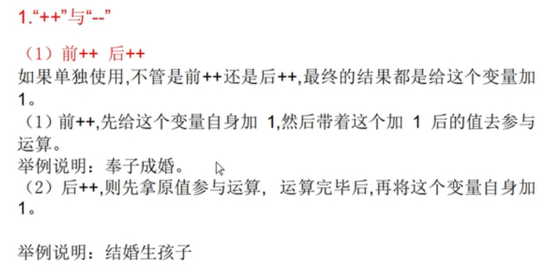
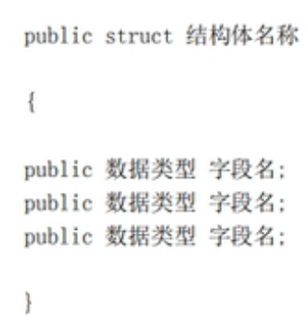
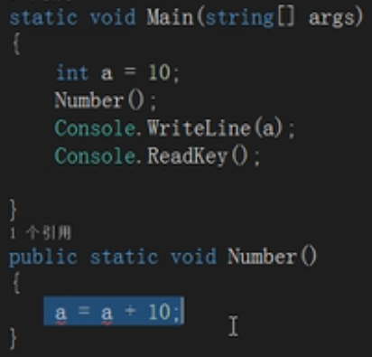

# unity script

`基本都是c语言基础`


## variable

1. char类型，只能存储一个字符

2. ++a和a++的区别


3. 同样可以使用复合赋值运算符+=这种

```c#
int speed = 10;
            int accelerate = speed++ + ++speed + ++speed;
>>>accelerate equal to 35
```

## 接受用户的输入

使用Console中的Readline()方法，就能接收到用户的输入了。
这里用户的输入只能使用string类型的数据进行接受，不能使用integer类型的数据进行接受。

## 转义字符

使用转义字符

* \n(换行)

* \"(取消双引号的转义）
* \t(表示一个tab键，如果想要实现不换行的话使用write不用writeline就是不换行的print)

* \b(一个删除键，会删除前一个字符，头尾不识别)

* @符号类似于r放在string的前面能够取消转义。还能实现字符串按原来的格式进行输出。

## 两种类型的转化

* 强制的类型转换

```c#
double a = 3.14;
int b = (int)a;
Console.WriteLine(b);
Console.ReadKey();
```

* double和integer类型的转化

```C#
int a = 10;
int b = 3;
double c = a/b;
>>> c=3
```

这里两个integer类型的数据进行计算，计算完成后将结果赋值给c，c的定义只是开启了一个内存地址，对计算没有帮助，给了什么值就是什么值。

* string和integer类型的转化

```C#
string a = "123";
string b = "456";
Console.WriteLine(Convert.ToInt32(a)+Convert.ToInt32(b));
Console.ReadKey();
```

这里使用Convert中的ToInt32方法将string转化成字符串。

## 逻辑判断符

1. && "and"

2. || "or"

3. ! "not"


## if statement

```c#
if (judgement){
 code
} else if (judgement){
    code
} else{
    code
}
// 这是顺序执行的，只要到了第二个else默认就是不满足第一个条件的了。
```

## switch 判断符

```c#
switch (variable){
    case value: code
    break；
    case value: code
    break；
    defalut: code // 上面的条件都不满足的时候执行这个代码
}
```

## while

```c#
while (condition){
    code
}
```

还有do while循环

## for 循环以及continue和break

格式为
`for(paramter, condition, chage code){}`
break可以实现中断循环。
continue;只是中断本次循环

## 常量const

使用const进行赋值就能保证数值不被修改
格式const plus 数据类型 plus 名称,在命名的时候尽量使用全大写的字母进行命名。

```c#
const string IP = "10.10.1.5"
```

## 枚举语法

什么是枚举：枚举就是自己定义一个数据类型，而不是使用系统自带的数据类型，这样能够避免混乱。
枚举类型 变量名 = 枚举类型.值
枚举不是放在main函数中的，可以放在类的后面也可以放在namespace整个项目的命名空间中，就是一个命名使用范围的区别。需要满足帕斯卡命名法
public表示访问权限，一共有三种访问权限

```C#
public enum Gender{
    male,
    female
}
//main函数中的调用：
Gender gender = Gender.male
// 也就是使用Gender类型中的一个选择，只要调用Gender就会选择类型而不是自己输入。
```

## 结构体

结构体是一种值类型，通常用于封装一些小型的变量数据
作用：可以帮助我们一次性的声明**多个不同类型的变量**。

声明结构体的位置同样是不放在main函数中，放在namespace中满足帕斯卡命名法。

```c#
    public struct Person
    {
        public string _name; // 字段不是以前意义上的变量
        public char _gender; // 变量只能有一个值，但是字段可以有很多值
        public int _age;// 为了区分字段和变量往往要加一个下划线来进行区分，是一种命名规范。
    }
    //main函数中的引用格式：
    Person student1;
    student1._name = "zhang";
    student1._gender = "m";
    student1._age = 18;
```

* 实现枚举和结构体的结合

```C#
    public struct Person
{
    public string _name;
    public Gender _gender;
    public int _age;
}
    public enum Gender
{
        male,
        female
    }// 注意结构体中的Gender类型
```

## 数组的语法

命名格式：
int[] number = new int[5];
int[] number1 = {1, 2, 3, 4，5};
两种方法都能实现创建一个数组。
命名了一个长度为5的list

* 使用数组的Length属性可以读取数组的长度

* 

创建一个字符串类型的数组其初始值是Null
创建一个bool类型的数组初始值是False

## 方法语句

就是函数格式为：
public static 返回值类型 函数名([参数列表]){
    code;
}
说明：public 访问修饰符，表示公开的公共的
static：静态修饰符
返回值类型：如果没有返回值就写void
参数列表：如果没有参数可以直接小括号留空

* 写完的方法必须要在main函数中进行调用，如果只声明不调用那么代码不会被执行。

* 函数的调用： 如果使用的函数和main函数在同一个类中的话，就不用写类名了， 

* 静态方法只能使用静态成员变量

* 如果方法中有返回值，那么就要用return语句来输出变量了，return语句还能实现结束循环。

* 现在就能理解console了，writeline也是一个方法只是，不在program类中，所以使用console.writeline来使用这个方法。

* 再比如console中的readline方法就能够接收到用户的输入，因为这个方法在创建的时候定义的只能接受字符串类型的数据所以只能用一个字符串类型的变量进行接受。

```C#
class Program
    {
        static void Main(string[] args)
        {
            int d = Program.Sum(3, 10);
            Console.WriteLine(d);
            Console.Readkey();
        }
        public static int Sum (int a, int b)
        {
            int c = a + b;
            return c;
        }
    }
```

* 变量的作用域，就是大括号的范围，只有在这个括号中定义的变量才能使用，不能再一个括号中使用另一个括号中的内容。

这段代码就会报错。

## 全局变量的使用

C#中没有全局变量的概念但是可以使用这样的命名手法实现全局变量的效果：
public static int _number;
使用static表示这是一个静态的变量类型，类似于之前的enum或者struct，下划线 **？？？**

## out参数和ref参数

* 如果一个函数返回多个不同类型的数值，就需要使用out参数

```C#
        static void Main(string[] args)
        {
            int a = 1;
            int b = 8;
            int sum = 0;
            int avg = 0;
            Program.Sum(a, b, out sum, out avg);
            Console.WriteLine(sum);
            Console.WriteLine(avg);
            Console.ReadKey();
        }
        public static void Sum(int a,int b, out int c, out int d)
        {
            //a = 10;
            //b = 19;
            c = a + b;
            d = c / 2;
        }
```

对于想要返回的值在前面写上out，这些参数就会返回给赋值的参数

* ref参数，将一个变量传入一个函数中进行处理，之后将处理后的值直接返回给变量。就是起到一个同步的作用。

```C#
        static void Main(string[] args)
        {
            int a = 1;
            Program.addself(ref a);
            Console.WriteLine(a);
            Console.ReadKey();
        }
            public static void addself(ref int a)
        {
            a++;
        }
```

## 函数的重载

函数的名称相同，但是参数的列表不同。调用这个函数的时候，系统会自动的给我们选择合适的函数进行重载。

可以重复的定义同样的函数只要参数列表不同就可以。

* Console.WriteLine()也是一种重载，会根据我们传入的数据类型自动匹配合适的方法。

* 重载只是一个概念。