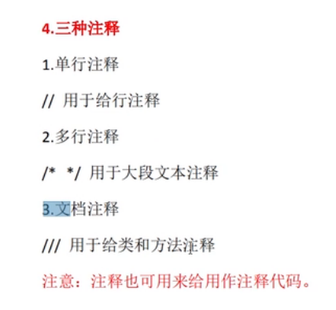
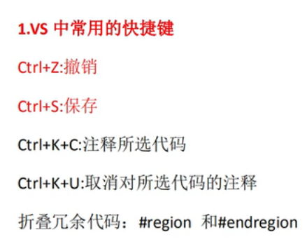
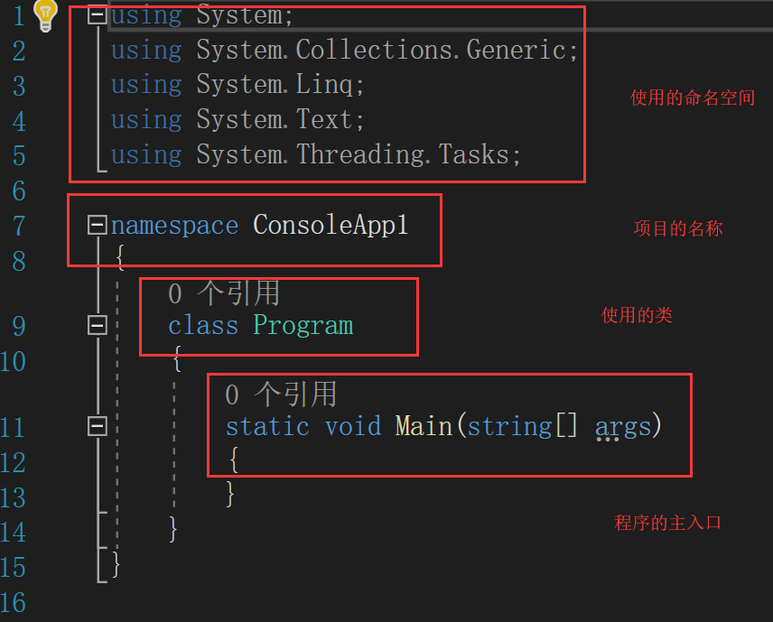

## visual studio

1. tips：
    * 三种注释方法

    * 常用的快捷键
    
    * 折叠代码：使用#region 和 #endregion能够实现将中间这部分呢代码进行折叠
    * 代码的调试，想要逐行的调试代码使用快捷键F11，之后每次按下F11就是执行下一行代码，可以在调试的界面中输入我们想要查看的数据类型。
    黄色的代码是将要执行的代码行。
    * 代码的逐行调试，首先选择一个断点，之后首先运行程序之后再使用F11逐行的调试代码。
    * 给visual studio添加新的模块 ：从 Visual Studio 中的菜单栏中选择“工具” > “获取工具和功能” ，打开“Visual Studio 安装程序” 。
    * 使用F12可以查看函数的源码
    * 将摄像机对准到当前位置：先选中摄像机之后选择Align with view

2. 在vs中方案包含项目项目包含类
一个C#代码的组成
